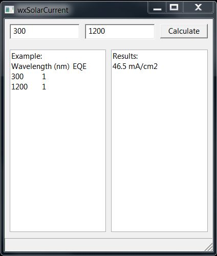

# wxSolarCurrent
A scientific GUI App that helps to calculate a solar cell short circuit current based on external quantum efficiency spectra

User pastes an experimental EQE data in format of:
Wavelength (nm) tab(space) EQE:

300 0.2

310 0.3

...

1100 0.3

1200 0.1

Than the app multiplies the data on solar flux located in amst.dat file (must be in the same folder as the app) and integrates the values in a range defined by user (default 300-1200 nm)

No additional wavelength step modification is needed. The app has its own interpolation algorithm. By default the wavelength step is modifies to 1 nm.

Uses C++ and [wxWidgets](https://wxwidgets.org/) library